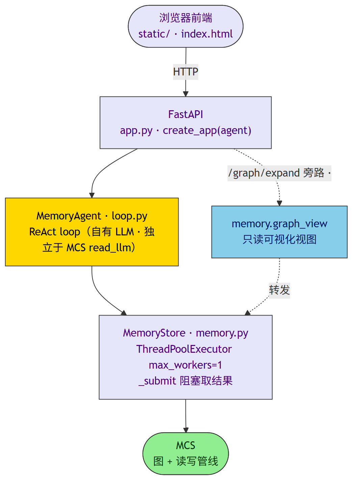
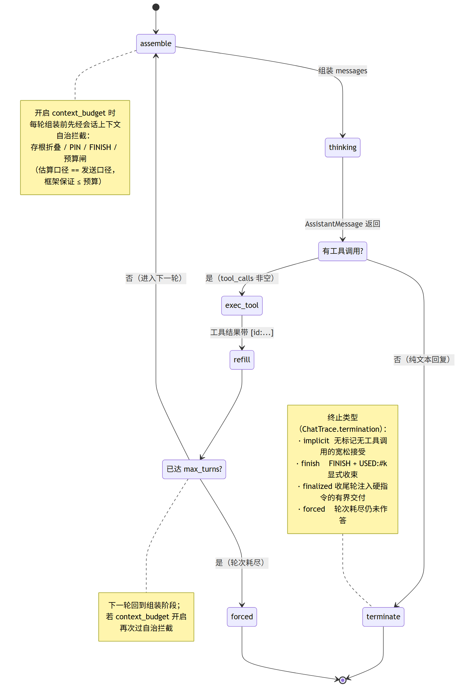
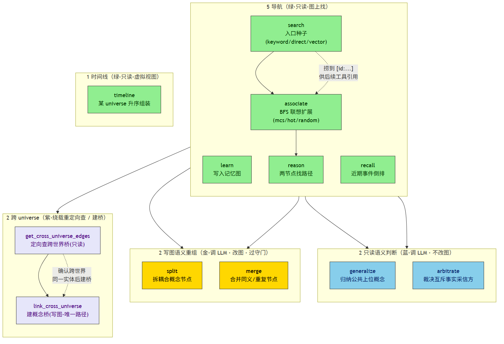
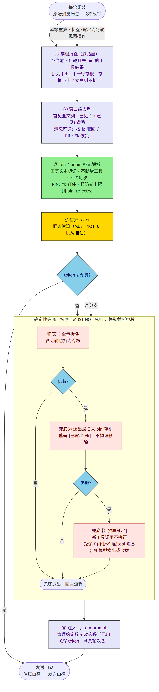

# 记忆 Agent

> `mcs_agent` 是建在 MCS 之上的对话式记忆助手：一个 **ReAct loop**，让 LLM 经 tool calling 自主决定
> 如何在记忆图里导航。本文讲架构、12 个工具（5 导航 + 1 时间线视图 + 2 只读语义判断 + 2 写图语义重组 + 2 跨 universe）、单线程封装、FastAPI 后端、启动方式，
> 以及它与 MCP server 的区别。
>
> **包结构**（change `mcs-mem-package-extract`）：`mcs_agent/` 是 agent 核心库（ReAct loop /
> MemoryStore / 工具 / 构造 + 基础 FastAPI app）；**个人记忆系统**（碎片 / 整合 / 日记 / 召回 /
> 管理看板）在独立 `mcs_mem/` 包，**单向依赖** `mcs_mem` → `mcs_agent` → `mcs`。记忆端点经
> `mcs_mem.create_app` 组装、挂同一 app（基础路由复用 `mcs_agent.register_base_routes`）。下文
> 「个人记忆」各节（捕获 / 整合 / 日记 / 管理看板）属 `mcs_mem`。

## 架构



- **MemoryAgent**（`loop.py`）：ReAct 循环。每轮把最新**图级主题摘要**注入 system prompt（让"要不要进图
  探索"的路由判断有据），LLM 返回工具调用或最终答复；工具结果回灌、最多 `max_turns` 轮。开启
  `context_budget` 时每轮组装经**会话上下文自治**（存根折叠 / pin / FINISH，见下文专节）。
- **自有 LLM（可插拔）**：agent 的 chat LLM **独立于 MCS 的 `read_llm`**，实现 `AgentLLMInterface`
  （`chat(messages, tools) -> AssistantMessage`）。内置 `OpenAIAgentLLM`（openai 兼容，覆盖 deepseek / ollama）
  与 `AnthropicAgentLLM`（原生 claude）；裸 callable 经 `CallableAgentLLM` 自动适配（测试可注入脚本化 mock）。
  详见下文「构造与可插拔 LLM 后端」。
- **导航决策权在 LLM**：选哪个工具、哪个种子、哪种扩展模式、找哪两个节点的路径，都由 LLM 决定；工具只是对
  MCS 能力的薄封装。



## 12 个工具（5 导航 + 1 时间线视图 + 2 只读语义判断 + 2 写图语义重组 + 2 跨 universe）

`BUILTIN_TOOLS`（`tools.py`，`ToolSpec` 注册表）定义的工具，经 tool calling 暴露给 agent 的 LLM
（`MEMORY_TOOLS` 保留为废弃别名）。工具集可经 `ToolsetConfig` 配置（启用子集 / 按工具名覆盖参数）：

| 工具 | 参数 | 作用 | 状态 |
|------|------|------|------|
| `learn` | `text` | 把信息写入记忆图（复用 MCS 写管线，自动抽概念入图）。仅当用户明确要求记住时调用 | ✅ |
| `search` | `query`, `mode`, `universe?` | 搜入口种子（默认 `__reality__` 内；查作品世界传 `universe`）。`keyword`=字面匹配名 / 别名（主力）；`direct`=顶层 hub；`vector`=向量检索 | keyword ✅ / direct ✅ / vector ✗ |
| `associate` | `seed_id`, `mode` | 从种子 BFS 联想扩展。`mcs`=事实 BFS（主力）；`hot`/`random` | mcs ✅ / hot·random ✗ |
| `reason` | `source_id`, `target_id` | 在两个已知节点间找连通路径（无向 BFS，允许失败） | ✅ |
| `recall` | `limit` | 回忆最近发生的事件（时间倒排、纯近期口径，受 `limit` 与 T 双约束） | ✅ |
| `timeline` | `universe`, `limit?` | 叙事时间线：某 universe 事件层按时间**升序**组装（查询期虚拟视图、只读不落图）。作品世界传作品名、现实传 `__reality__`；作品纪年数字年可排（混合纪年 Phase 2）。与 `recall`（近期倒排）互补 | ✅ |
| `generalize` | `node_ids`, `focus?` | 概括若干节点的公共上位概念 / 共性（只读 LLM 判断，不改图） | ✅ |
| `arbitrate` | `node_ids`, `question` | 对若干互斥事实反查背书事件、裁决采信方 + 理由（只读 LLM 判断，不改图） | ✅ |
| `split` | `node_id`, `focus?` | 拆分粒度耦合的概念节点（类别-特化 / 多实体误并）为多个独立节点（写图，过守门） | ✅ |
| `merge` | `node_ids`, `focus?` | 合并若干本就同一个的节点（异名/同义/重复建）为一个（写图，互斥禁合，过守门） | ✅ |
| `get_cross_universe_edges` | `node_id`, `limit?` | 定向查某节点的跨 universe 桥（只读，绕载重）——单 universe 查询默认不跨，需确认跨世界关系（如演义曹操↔正史曹操）时用 | ✅ |
| `link_cross_universe` | `source_id`, `target_id` | 给两个不同 universe 的节点建概念桥（写图，唯一创建路径）——仅"同一实体的不同世界叙述"时调；同 universe 勿用 | ✅ |



未实现的模式以**空壳诚实返回**提示（不伪造）；工具返回的节点都带 `[id:...]`，供后续工具引用
（`search → associate → reason` 链式导航）。

### generalize / arbitrate：只读 LLM 语义判断

这两个工具与 5 个纯导航工具不同——它们**调 MCS 的 LLM 插件**（经 `read_manager.get_all(PluginType.LLM)`
取实例、`plugin.call(purpose, nodes_in, free_args)`，与 `learn`/`associate` 在 worker 线程触发 LLM 同一
既定模式），对已捞到的若干节点做**语义判断**，但**不改图、不触发写 / 守门 / 裂变**：

- **`generalize`（归纳）**：给若干节点 id → 渲染为喂 LLM 的 material → 经 `generalize` purpose 让 LLM
  概括它们的公共上位概念 / 共性 → 返回文本。帮 agent 理解一组相关概念的关系，而非靠自身猜测脱钩于图里真实
  存的节点。material 超 `token_budget.T` 时按序丢尾节点截断（≥1 兜底）。
- **`arbitrate`（仲裁）**：给若干互斥事实 id + 问题 → 经 `store.get_related_events(fact_id, limit=K)`
  **定向反查**每个事实的背书事件（时间倒排、绕载重规则、取最近 K 条，K 默认 3、可经
  `ToolsetConfig.params["arbitrate"]["events_per_fact"]` 覆盖）→ 自建装配「事实全文 + 其事件行」material
  （事件复用行级渲染、含 timestamp）→ 经 `adjudicate` purpose 让 LLM 裁决**采信哪个事实 + 理由** → 过滤
  幻觉 id（只留传入事实 id）→ 渲染「采信 [id:X]（...），理由：...」。事件过多时按**轮转保底**截断 material
  至 ≤ T（每事实至少留 1 条、不削光某事实致证据失衡）。

> **命名消歧**：`arbitrate` 工具内部走 purpose `adjudicate`，与查询管线 `LLMArbitrationPlugin` 的
> `arbitrate` purpose 同名但**不同域、无关**（后者只返 `list[str]`、不吃事件）。

两工具的 `node_ids` 由前序工具（`search`/`associate`）返回的 `[id:...]` 提供，返回文本也带 `[id:...]`
供链式引用。裁决是**建议性只读结论**（非永久解决互斥），最终答复由 agent 综合判断。

### split / merge：写图语义重组

这两个工具与上面的只读判断工具一样**调 MCS 的 LLM 插件**产方案，但**改图**——对已捞到的节点做概念重组，组合 store 的 `add/delete/update` 原语执行、走 `snapshot/restore` 原子事务、过 `MCS.run_compaction` 守门：

- **`split`（拆分）**：给一个节点 id → 加载其全部原边（关联/互斥 + 事件背书）→ 经 `split` purpose 让 LLM 判该节点是否**耦合了多个语义中心**（类别-特化，如"按摩"实讲泰式；或多实体误并，如"小明和小红"）→ 产出拆分方案（产物 `into` + 产物间 `relation` + 每条原边归属）→ 执行（建产物 / 迁边 / 删原节点）→ 过守门。仅拆**概念节点**（事实带互斥/背书、事件/source 规则入库，拆它们破坏语义）；原节点若为 hub，parent 产物继承 hub 标记（下钻成员层级由守门 `decide_hub` 重判）。未耦合返回 `noop` 不执行（双重防误触发：主 LLM 判断 + 专用 prompt 复核）。补 core 自动合并之外的"**拆分**"能力——增量抽取的粒度判错（有合无分）靠它修正。
- **`merge`（合并）**：给若干节点 id → 经 `merge` purpose 判是否**本就同一个**（异名/同义/重复建）→ 产出合并方案（keep/absorb/merged_content/aliases）→ 执行（边与事件背书迁向 keep、aliases 收口、absorb 的 hub 标记继承到 keep、删 absorb）→ 过守门。**互斥禁合三闸**（keep↔absorb 塌缩 / absorb↔absorb 塌缩 / absorb 带互斥边且 keep 非 fact 无法承接）；非同义 `noop`。core 写入已自动合并同义，本工具用于 agent 发觉残留重复、主动收口。

两工具的 `node_id(s)` 由前序工具返回的 `[id:...]` 提供；返回文本含产物 / keep 节点 id（**守门前快照**——`run_compaction` 的 `decide_hub` 可能重组 / 合并产物或 keep 邻域，agent 后续引用前建议重新 `search` 定位）。两者 `readonly=False`，排除出 `/recall` 只读召回白名单（保"召回 MUST NOT 写图"）。

## 会话上下文自治（`context_budget`，默认关闭）

> change `agent-context-autonomy`：框架保证**单一硬预算**（会话层铁律一：估算口径 == 发送口径，
> MUST NOT 交 LLM 自估），预算内的取舍全部交模型自决策。`MemoryAgent(context_budget=None)`
> （默认）零行为变化；bench / 调用方显式传预算开启。实现在 `mcs_agent/context.py`（`SessionContext`），
> loop 只做接线；原始消息历史**永不改写**，折叠 / 逐出均为每轮组装期的视图操作（幂等重算）。

**新参数**（`MemoryAgent`）：`context_budget`（会话预算 token，None=关闭）、`fold_after_turns`
（存根折叠轮龄 N，默认 2）、`pin_cap_ratio`（pin 总量防御上限占预算比例，默认 0.7）、
`token_counter`（token 估算函数，默认保守经验式 `CalibratedEstimator`）。



**存根折叠（减脂层）**：距当前 ≥ N 轮且未 pin 的工具结果折叠为一行存根（id 来源：解析工具
返回文本的 `[id:...]`）；存根不比全文短则不折（总量不降的重组无效）：

```
[已折叠 #1] search({"query": "Sam Altman"}) → 12 节点: [id:a1f], [id:9c3], ...
[已折叠 #2] associate({"seed_id": "a1f"}) → 5 节点: [id:x9] (+4 已见)
```

- id **窗口级去重**：首见全文列出、已见计数省略（`(+4 已见)`）；被折叠内容按 `[id:...]` 经
  associate/search 取回，或直接 `PIN: #k` 恢复该存根全文（**遗忘可逆**）。
- **同参标注**：与窗口内存根同工具同参的再次调用**正常执行**（不拦截不缓存——相关性判断是
  积累集依赖的，重看可得新判断；learn 会改图，缓存亦不正确），仅在结果头部标注
  `（与存根 #1 同参）`。

**pin / FINISH（自治层——回复文本标记，框架解析，不新增工具、不占轮次）**：

- `PIN: #k`（可多个，空格分隔）钉住已确认支撑答案的结果，不被折叠 / 逐出；`UNPIN: #k` 换出。
  pin 总量超防御上限时该 PIN 被拒绝（trace 记 `pin_rejected`）。
- `FINISH` + `USED: #k`：模型判断**无需再遍历**时显式收束，终止回复携带最终答案与支撑引用
  （存根编号 / 节点 id）；框架剥离标记后返回答案。无标记且无工具调用的回复仍宽松接受
  （记 `implicit`，不为格式合规浪费轮次）。引用提取两级：规范 `USED:` 行优先（显式声明
  按相关性有序）；无规范行时**宽松提取**终止回复中的全部 `[id:...]`（按出现序去重）——
  把格式采纳率变成实际上限。
- **收尾轮**：剩余 1 轮时预算段替换为「最后一轮请直接作答」；轮次耗尽仍未作答则追加**一次**
  有界收尾调用（注入「立即交付」硬指令、忽略其中的工具调用）——有内容即剥离标记交付
  （记 `finalized`，forced 从"无答案失败"降级为"降级交付"）、无内容保持 forced 兜底。
- **交付契约（调用方输入）**：`USED:` 的具体要求（如"列出支撑答案的来源节点、按相关性降序、
  宁缺毋滥"）由**调用方**经 `system_prompt` 附加段声明——框架只提供标记槽位与解析
  （`ChatTrace.used_refs` 保序），不硬编码任何任务/配额知识；模型显式知道调用目的，
  但契约内容永远归调用方（评测契约见 `bench/multihop_rag/scripts/agent_case_study.py`
  的 `USED_CONTRACT_PROMPT`，`--used-contract` 开启）。

**确定性兜底**（超预算时按序，MUST NOT 死锁 / 静默截断中段）：全量折叠（含近轮）→ 逐出最旧
未 pin 存根（墓碑 `[已逐出 #k]`——openai 格式要求 tool_call 配对结果消息，不物理删除）→
仍超则新工具调用**不执行**、以受保护（不折不逐）的 `[预算耗尽]` tool 消息告知模型换出或收尾。

**预算可见**：每轮 system prompt 注入管理约定段 + 动态段「已用 X/Y token，剩余轮次 Z」——
终止信号，模型据此决定收尾或继续。

**可观测**：折叠 / 逐出 / pin / unpin / 拒绝注入 / overflow / dup_call（同参重发，detail 含
pin 集是否变化）事件入 `ChatTrace.context_events`（fold 含前后 token）；终止类型
（`finish` / `implicit` / `finalized` / `forced` / `error`）与 `USED:` 引用入
`ChatTrace.termination` / `used_refs`。

**A/B 验收结果**（multihop 200 题三臂，2026-07-18，详见
`bench/multihop_rag/reports/agent_context_autonomy_20260718.md`）：ctx 臂 token/题 **-33%**
（127K→85K）、reached **+5.0pt**（0.880→0.930）、32K 预算零逐出零拒注（折叠层独立守住硬闸）；
**USED 契约臂全面最优**——reached 0.975、hit@10 0.855（基线 0.795）、mrr@10 0.577、token 仍 -12%，
收尾轮把无答案 forced 从 56% 压到 9%。已知边界：pin 语义对 deepseek-chat 采纳≈0（收益全部来自
不依赖模型配合的折叠层）；盲目重复率 4.6%；USED 引用格式采纳率 12%（下一改进杠杆）；
排序天花板仍在词法 doc_rerank（黄金笼结论一致）。

## MemoryStore：MCS 的单线程封装

MCS 非线程安全、SQLite 连接绑创建线程，所以 `MemoryStore`（`memory.py`）把 MCS 的**构造与全部调用都收束到
同一个单 worker 线程**（`ThreadPoolExecutor(max_workers=1)`）：每个原语经 `_submit` 丢给 worker、阻塞取结果，
调用方线程绝不直接触碰 MCS / store。

它在 12 个 LLM 工具之外还暴露 `graph_summary`（读图级主题摘要）、`graph_view`（只读可视化视图）
等原语。其中 `find_path` 是 `reason` 工具背后的无向 BFS（下钻成员 + 关系边端点都算邻居）；
`generalize` / `arbitrate` 是调 MCS LLM 插件的只读语义判断原语（见上节）。

## FastAPI 后端

**基础 app**（`mcs_agent/app.py` 的 `create_app(agent)`）：`/chat` / `/health` / `/graph/expand` + 静态前端兜底。
**记忆应用 app**（`mcs_mem/app.py` 的 `create_app(agent, fragment_store=None)`）：在基础路由（复用
`mcs_agent.register_base_routes`）之上扩展记忆端点 + `/manage.html` + scheduler，挂同一 app。
下表含全部路由（基础 + 记忆）：

| 路由 | 方法 | 作用 |
|------|------|------|
| `/chat` | POST `{message}` → `{reply}` | 跑一轮 agent ReAct |
| `/recall` | POST `{message}` → `{reply}` | 只读召回（禁 learn 的 ReAct） |
| `/health` | GET | 健康检查 `{ok: true}` |
| `/graph/expand` | GET `?node_id=__seed_root__` | 只读图谱可视化：转发 `memory.graph_view`（缺省虚拟根） |
| `/note` | POST `{content}` → `{ok, date, time}` | 记录消息到当天碎片（Slice 1 捕获层） |
| `/fragments` | GET → `{fragments: [...]}` | 列出碎片文件（按日倒排） |
| `/fragments/{date}` | GET → `{date, content}` | 读取指定日期碎片 |
| `/fragments/{date}` | PUT `{content}` → `{ok, date}` | 覆盖指定日期碎片（供 UI 编辑） |
| `/consolidate` | POST `{date?}` → `{ok, date, status, events}` | 触发整合（默认昨天；今天须显式 date） |
| `/consolidate/status` | GET `?date_param=` → status dict | 查询单日整合状态 |
| `/consolidate/statuses` | GET → status list | 查询全量整合状态 |
| `/diary` | POST `{date?}` → `{ok, date, reason?}` | 生成/重生成日记 |
| `/diary/{date}` | GET → `{date, content}` | 读取指定日期日记 |
| `/diaries` | GET → `{diaries: [...]}` | 列出已生成日记 |

`/` 兜底挂 `static/`（前端 `index.html`，对话 + Cytoscape 图谱可视化）。CORS 开发期全开、生产按域名收紧。

## 构造与可插拔 LLM 后端

`mcs_agent` 提供编程式 / YAML / 环境变量三条构造路径，都经 `AgentBuilder`：

```python
from mcs_agent import create_agent, AgentConfig, AgentBuilder

# 1. 工厂（kwargs）——一份 LLM 配置同时喂 agent chat 与 MCS 抽取
agent = create_agent(
    db_path="mem.db", llm_provider="deepseek",
    llm_model="deepseek-chat", llm_api_key="sk-...",
)

# 2. YAML（agent.yaml 承载统一 llm + 可选 mcs_config 路径 + db_path / tools）
cfg = AgentConfig.from_file("agent.yaml")
agent = AgentBuilder(cfg).build()
```

**统一 LLM**：单一 `LLMConfig`（provider/model/api_key/base_url/auth_token）同时驱动 agent 的 chat LLM
与 MCS 的 write/read LLM（provider 键映射两侧）。`mcs_config`（完整 MCSConfig）作逃逸口——想给 MCS 配不同
LLM 时传它（此时 agent chat LLM 仍取 `llm`）。

可插拔 LLM 后端（按 `LLMConfig.provider` 选；统一 provider 集 = agent adapter ∩ MCS 插件）：

| provider | agent adapter | MCS 插件 | 说明 |
|---|---|---|---|
| `deepseek` | `OpenAIAgentLLM` | `deepseek_llm` | openai 兼容；默认 base_url `https://api.deepseek.com` |
| `ollama` | `OpenAIAgentLLM` | `ollama_llm` | openai 兼容；默认 `http://localhost:11434/v1`；需任意占位 `api_key`（openai SDK 要求非空） |
| `claude` | `AnthropicAgentLLM` | `claude_llm` | anthropic 原生；`auth_token`（Bearer）优先于 `api_key` |

> 官方 `openai` 无 MCS 插件，**不作统一 provider 键**（落入"未知 provider 早失败"）。要连任意 openai 兼容
> 端点，用 `deepseek`/`ollama` 键 + 自定义 `base_url`；想给 MCS 配独立 LLM 走 `mcs_config` 逃逸口。

`db_path` 指向已有 SQLite 图时，`SQLiteStore` 构造时自动加载其数据（不重建空图）。

## 启动

```bash
export MCS_CONFIG=/path/to/mcs.yaml       # MCS 图配置（→ mcs_config 逃逸口，MCS LLM 由 yaml 决定）
export AGENT_LLM_API_KEY=sk-...           # agent chat LLM
export AGENT_LLM_MODEL=deepseek-chat
export AGENT_LLM_PROVIDER=deepseek        # 默认 deepseek；可选 ollama / claude
# export AGENT_LLM_BASE_URL=...           # 可选，自定义端点（覆盖 provider 默认）
python -m mcs_mem                          # 记忆应用（基础 + 碎片/整合/日记/召回/看板），默认 http://127.0.0.1:8000
# python -m mcs_agent                      # 仅基础 agent app（/chat /graph，无记忆功能）
```

缺关键环境变量时以非零码退出（早失败）。也可不经 env，直接 `create_app(create_agent(...))` 编程式启动。

## 与 MCP Server 的区别

| | MCP Server（`mcs_mcp`） | 记忆 Agent（`mcs_agent`） |
|---|---|---|
| 谁来决策 | **外部客户端**（Claude Desktop 等）的 LLM | **自带** LLM（ReAct loop） |
| 接口 | MCP stdio 工具（`query` / `ingest`） | HTTP（`/chat`）+ 前端 |
| 工具粒度 | 粗（一次 query 走完整管线） | 细（12 个原语，LLM 分步组合） |
| 用途 | 把图当工具接入已有 Agent | 独立的对话式记忆助手 |

两者都用单 worker 线程封装 MCS（线程安全铁律），都复用 `mcs.rendering` 的渲染纯函数。

## 个人记忆——捕获层（`mcs_mem`）

`mcs_mem` 在 `mcs_agent` 之上提供**碎片捕获层**：随手发消息就记到当天 Markdown 碎片文件，零 LLM、零入图。它是个人记忆系统 4 片的地基（捕获 → 整合 → 日记 → UI）。

### 工作方式

每条消息以 `HH:MM 内容` 格式实时追加到当天 `YYYY-MM-DD.md` 文件。碎片是保真原始层——只存、不解析、不入图、不调 LLM。整合（入图）和日记（概括）是后续切片的事。

### 存储与配置

碎片文件默认存在 `~/.mcs_memory/fragments/`（`Path.home()` 兼容 Windows），可通过环境变量 `MCS_MEMORY_FRAGMENTS_DIR` 配置。目录不存在自动创建。碎片是纯文本 Markdown，可直接用编辑器打开修改。

### 捕获 API

| 路由 | 方法 | 作用 |
|------|------|------|
| `/note` | POST `{content}` → `{ok, date, time}` | 记录一条消息到当天碎片（空内容 → 422） |
| `/fragments` | GET → `{fragments: [...]}` | 列出已有碎片文件（按日期倒排） |
| `/fragments/{date}` | GET → `{date, content}` | 读取指定日期碎片内容（不存在 → 404） |
| `/fragments/{date}` | PUT `{content}` → `{ok, date}` | 整文件覆盖（供管理 UI 编辑，不存在则创建） |

捕获端点挂在 `mcs_agent` 的 FastAPI app 上（与 `/chat` 同居），**不依赖 agent / MCS**——即使注入 fake agent（无 memory），`/note` 等仍正常工作（纯文件 IO 旁路）。

## 个人记忆——整合入图

整合管线把碎片去噪后逐条 ingest 入图：读当天 MD → 逐行解析 → 去噪（Consolidator 应用层前置过滤）→ 逐条 `ingest_structured` 入图（一碎片一事件、时间忠实）。

### 去噪

去噪在 Consolidator 内部、ingest 调用之前执行（**不走 WRITE_PREPROCESS 插件**——该插件契约纯变换、MUST NOT skip，丢不掉输入）。去噪只作用于整合路径，agent 直接 `learn` 不经去噪。

去噪器由 `create_app` 据 agent 接入：agent 暴露 `llm` 时用 `LLMDenoiser`（逐碎片轻量判去留，LLM 调用在 worker 线程外执行、不阻塞 MCS 单 worker，保守策略——拿不准就留）；无 `llm` 时退化为默认全保留（不丢任何碎片）。

### 单日锁定

某日 `done` 后锁定：再触发返回 `already`，不重跑，无 force。`done` 后改 MD 不再入图（改动只留 MD 保真层）。

### 定时调度

`ConsolidationScheduler`（封装 APScheduler）随 `mcs_agent` 的 FastAPI lifespan 起停：app 启动且 agent 具备 `ingest_structured` 时自动注册，关闭时优雅停止。默认 cron `30 0 * * *`（每天 00:30 整合**昨天**——已封口的那天，避免「夜间整合当天 + 单日锁定 → 当天后续消息成孤儿」）。经环境变量配置：`MCS_CONSOLIDATION_CRON`（cron 表达式）、`MCS_CONSOLIDATION_ENABLED`（`false`/`0`/`no` 禁用，仅留手动触发）。

### 整合 API

| 路由 | 方法 | 作用 |
|------|------|------|
| `/consolidate` | POST `{date?}` → `{ok, date, status, events, warning?}` | 触发整合（无 date 默认昨天；整合今天须显式 date + 返回 warning） |
| `/consolidate/status` | GET `?date_param=` → `{date, status, events, ...}` | 查询单日整合状态 |
| `/consolidate/statuses` | GET → `[{date, status, ...}, ...]` | 查询全量状态（供日历渲染） |

整合需 MCS / LLM；无 memory / LLM 时返回 503，不影响捕获等其他路由。

## 个人记忆——日记生成

日记生成把当天碎片概括成一篇人读的日记 Markdown，存独立目录（`~/.mcs_memory/diaries/`），**不进图**。日记可重生成（覆盖），无单日锁定。

日记概括当天**全部碎片**，不跳过 Slice 2 去噪丢弃的内容——图谱噪声 ≠ 日记噪声（"喝了杯咖啡"对图是噪声、对日记是正经记录）。

### 日记 API

| 路由 | 方法 | 作用 |
|------|------|------|
| `/diary` | POST `{date?}` → `{ok, date, reason?}` | 生成/重生成日记（默认当天；无碎片 → `no_fragments`） |
| `/diary/{date}` | GET → `{date, content}` | 读取指定日期日记（不存在 → 404） |
| `/diaries` | GET → `{diaries: [...]}` | 列出已生成日记（按日期倒排） |

## 个人记忆——管理看板

管理看板（`/manage.html`）一站式覆盖：记录 / 碎片编辑 / 整合日历 + 触发 / 日记 / 召回 / 嵌入图谱。从聊天页（`/`）或图谱页（`/graph.html`）顶部导航可直达。

### 召回（只读）

召回走独立 `POST /recall` 端点，用 `ToolsetConfig` 构造禁 `learn` 的只读 agent 实例跑 ReAct——召回不该写图。

## 进一步阅读

- [architecture.md](architecture.md) — MCS 本体
- [getting-started.md](getting-started.md) §7 — 一行启动
- [mcp-server.md](mcp-server.md) — 另一种暴露方式
