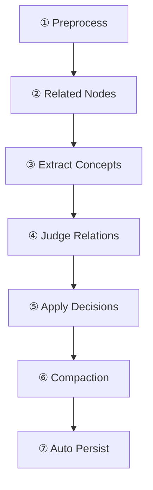
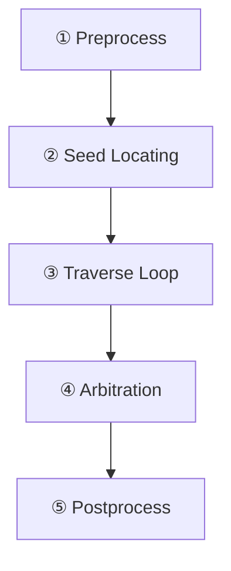

## Context

当前 MCS 类（`mcs/core/mcs.py`）是一个「胖编排器」：持有 MCSConfig、管理两个 PluginManager、执行 initialize()/shutdown() 生命周期、处理 LLM 注册分离、初始化 Store、构建 WritePipeline 和 QueryEngine、执行 load-on-startup。用户必须先 `MCS(config)` 再 `.initialize()`，两步流程易出错且语义不清。

Builder（`mcs/core/builder.py`）目前只是轻量抽象基类——收集插件注册表、委托 MCS 的 initialize()。Phase1Builder 继承同样模式。

核心问题：
1. MCS 职责过多——配置持有、插件注册、生命周期、存储操作混在一起
2. `register_plugin()` 双注册语义不清——无法指定目标是 writer 还是 reader
3. `persist_full()` / `_try_load_from_storage()` 是存储层操作，不属于顶层编排器
4. initialize() / shutdown() 生命周期由 Builder 一步 build() 替代更自然

## Goals / Non-Goals

**Goals:**
- MCS 退化为瘦门面：只暴露 `ingest()` / `query()` / `show()` / `register_plugin()` / `unregister_plugin()`
- Builder 一次 `build()` 返回即用的 MCS 实例（含 Store 初始化、插件注册、PluginContext 注入、管线构建、load-on-startup）
- 插件注册/注销必须指定目标管线（`"writer"` | `"reader"`）
- `show()` 以 Markdown 流程图展示双管线的插件注册与处理阶段
- 移除 MCS 对 MCSConfig 的直接依赖

**Non-Goals:**
- 不改变 WritePipeline / QueryEngine 的内部阶段逻辑
- 不改变 Plugin 基类 / PluginManager 的核心 API
- 不重构 MCSConfig 的数据结构（保持为 Builder 输入）
- 不改变 Store 接口或存储实现
- 不改变 `create_mcs()` 工厂函数的外部签名

## Decisions

### D1: MCS 构造签名变更

**Decision**: MCS 构造器只接受已组装好的 writer / reader 管线 + store + 双 PluginManager，不再接受 Config。

```python
class MCS:
    def __init__(
        self,
        write_pipeline: WritePipeline,
        query_engine: QueryEngine,
        store: StoreInterface,
        write_manager: PluginManager,
        read_manager: PluginManager,
    ): ...
```

**Rationale**: Config 是 Builder 的输入而非 MCS 的输入。MCS 只需要已经绑好的管线实例。这样 MCS 完全不依赖 MCSConfig，也不需要 initialize()。

**Alternative**: 保留 Config 作为可选参数向后兼容 → 拒绝，因为会让两个初始化路径共存，违反「Builder 是唯一构建路径」的设计意图。

### D2: register_plugin / unregister_plugin 指定目标管线

**Decision**: 注册和注销必须指定 `target: Literal["writer", "reader"]`。

```python
def register_plugin(self, plugin: Plugin, target: Literal["writer", "reader"]) -> None:
    if target == "writer":
        self.write_manager.register(plugin)
    else:
        self.read_manager.register(plugin)

def unregister_plugin(self, name: str, target: Literal["writer", "reader"]) -> None:
    if target == "writer":
        self.write_manager.unregister(name)
    else:
        self.read_manager.unregister(name)
```

**Rationale**: 用户明确知道自己在给哪条管线加插件，避免双注册的语义混淆。共享插件由 Builder 在 build() 时同时注册到两侧，运行时不再支持"一次注册两侧"。

**Alternative**: 提供 `target="both"` 选项 → 拒绝，共享插件是构建时概念，运行时注册应明确指定目标。

**补充：`register_shared_plugin()` 便捷方法**：运行时仍有共享注册需求（如测试中注入 mock LLM 到两侧），提供便捷方法：

```python
def register_shared_plugin(self, plugin: Plugin) -> None:
    """将同一插件实例注册到 write_manager 和 read_manager 两侧。"""
    self.write_manager.register(plugin)
    self.read_manager.register(plugin)  # 同实例，跨 manager 不冲突
```

**Rationale**: `PluginManager.register()` 的重复检查是**单 manager 内**的（`self._plugins` 是实例属性），同一插件实例注册到不同 manager 不会触发 ValueError。`register_shared_plugin()` 封装了这个常见模式，减少测试代码改动量。

### D3: 移除 persist_full / _try_load_from_storage

**Decision**: 从 MCS 移除这两个方法。持久化逻辑：
- `persist_full()` → 用户直接调用 `mcs.store.save_full()`（Store 已是公共属性）
- `_try_load_from_storage()` → Builder 在 build() 末尾执行，对用户透明

**Rationale**: 这些是 Store 层操作，不应出现在顶层编排器。Builder 在组装完成后自动做 load-on-startup，用户无需感知。

### D4: Builder 接管全部初始化

**Decision**: `MCSBuilder.build()` 执行以下完整流程：

1. 实例化 Store（根据 config.plugin_configs 中的 sqlite_storage 配置）
2. 实例化 TokenBudget
3. 按配置实例化所有插件（shared → 双注册, write → write_manager, read → read_manager）
4. 处理 LLM 分离逻辑
5. 初始化 SQLiteStore（schema_extensions + node_extensions）
6. 构建 PluginContext 并初始化插件
7. 应用 prompt_overrides 到 LLM
8. 构建 QueryEngine（read_manager + read_llm）
9. 构建 WritePipeline（write_manager + write_llm + query_engine）
10. 构建 MCS（传入已组装好的所有组件）
11. 执行 load-on-startup
12. 返回 MCS 实例

**Rationale**: 将 initialize() 的全部逻辑搬到 Builder，MCS 构造后即处于 ready 状态。

### D5: show() 方法设计

**Decision**: `show()` 返回 Markdown 格式的流程图，展示 writer 和 reader 各自的插件和处理阶段。

```python
def show(self) -> str:
    """以 Markdown 流程图展示双管线的插件注册与处理流程。"""
```

输出示例：
```markdown
## Writer Pipeline



**Plugins:** idempotency_check(Preprocess), fanout_reducer(Compaction), summary_regen(Compaction)

## Reader Pipeline



**Plugins:** alias_entry(Entry), hub_fallback(Entry), priority_trim(Trim)
```

**Rationale**: Mermaid 流程图在 GitHub/VS Code 中可渲染，同时提供文本概览。

### D6: shutdown 语义与共享插件去重

**Decision**: MCS 提供 `shutdown()` 方法，负责关闭所有插件和 Store。共享插件实例只 shutdown 一次。

```python
def shutdown(self) -> None:
    """关闭所有插件和存储，共享插件只 shutdown 一次。"""
    # 收集所有插件实例（去重，因为共享插件在两个 manager 中是同一实例）
    all_plugins: dict[str, Plugin] = {}
    for name, plugin in self.write_manager._plugins.items():
        all_plugins[name] = plugin
    for name, plugin in self.read_manager._plugins.items():
        if name not in all_plugins:
            all_plugins[name] = plugin

    # 按顺序 shutdown（每个插件只一次）
    for plugin in all_plugins.values():
        plugin.shutdown()

    # 关闭 Store
    if hasattr(self.store, 'shutdown'):
        self.store.shutdown()
```

**Rationale**: 即使构建由 Builder 完成，运行时仍需优雅关闭。共享插件（如 mock_llm）在两个 manager 中是同一实例，必须去重避免重复 shutdown。此逻辑从当前 `mcs/core/mcs.py:288-309` 保留。

## Risks / Trade-offs

- **[Breaking Change] register_plugin 签名变更** → 所有调用处需加 target 参数；提供 `register_shared_plugin()` 便捷方法减少改动量
- **[Breaking Change] MCS(config).initialize() 不再可用** → 所有测试和用户代码需改为 Builder().build()；create_mcs() 工厂函数签名不变，覆盖大部分用例
- **[Risk] Builder.build() 变重** → 保持 build() 逻辑线性、无分支，每步职责明确；可拆为私有方法（_init_store, _register_plugins, _build_pipelines 等）
- **[Trade-off] 运行时不再支持隐式双注册** → 改用 `register_shared_plugin()` 显式表达意图，语义更清晰；Builder 已处理构建时共享逻辑

## Implementation Details

### D7: PluginManager.unregister() 方法

**Decision**: `PluginManager` 新增 `unregister(name: str)` 方法。

```python
def unregister(self, name: str) -> bool:
    """移除已注册的插件。

    Args:
        name: 插件名称

    Returns:
        True 如果成功移除，False 如果插件不存在
    """
    if name not in self._plugins:
        return False
    plugin = self._plugins.pop(name)
    for plugin_type in plugin.get_types():
        if plugin_type in self._by_type:
            try:
                self._by_type[plugin_type].remove(plugin)
            except ValueError:
                pass  # 已经不在列表中
    return True
```

**Rationale**: `MCS.unregister_plugin()` 需要委托给 manager，当前 `PluginManager` 只有 `register()` 没有 `unregister()`。

### D8: ContextRenderer 构建时机

**Decision**: Builder 在构建 `PluginContext` 前先创建 `ContextRenderer`，并传入 `read_manager`。

```python
# Builder.build() 中的构建顺序
context_renderer = ContextRenderer(read_manager)  # 先创建，用于 PluginContext

write_ctx = PluginContext(
    store=store,
    config=config,
    token_budget=token_budget,
    context_renderer=context_renderer,
    plugin_manager=write_manager,
)
```

**Rationale**: `ContextRenderer` 需要 `read_manager` 来获取 `NodeExtension` 插件。构建顺序：`双 manager 注册完成` → `ContextRenderer` → `PluginContext` → `插件初始化` → `管线构建`。
